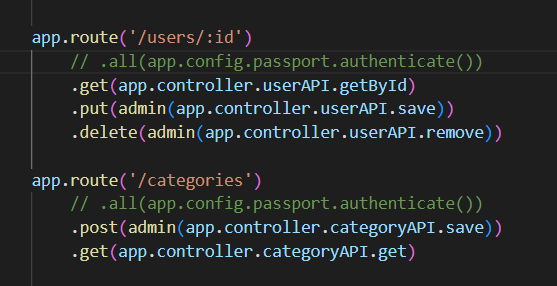
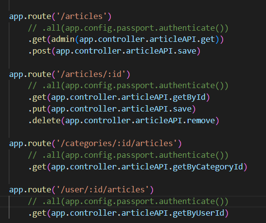

# Projeto FullStack
### Configuração inicial
➡️ Antes de iniciar a aplicação é necessário criar um arquivo **.env** na raiz da API, dentro dele é necessário colocar as informações cruciais para o funcionamento da aplicação. Foi disponibilizado um arquivo **env_file** com um modelo que pode ser copiado e colado dentro do arquivo **.env**. 
➡️ Preencha os campos vazios com os dados configurados na sua aplicação (ex: DB_HOST, DB_NAME, DB_DIALECT, etc), não utilize aspas. 
✅ Após isso, a API pode ser inicializada com o comando *npm start*.

### 🛑 Para a utilização do front-end em conjunto do back-end é necessário fazer algumas alterações 🛑
#### ➡️ No arquivo *routes.js*, localizado na pasta /config do back-end, algumas linhas de código devem ser comentadas para o funcionamento correto das páginas.

✅ Após isso, utilize o comando *npm start* no back-end e, em seguida, utilize a extensão live server do Visual Studio no arquivo **login.html** e o serviço front-end funcionará.
